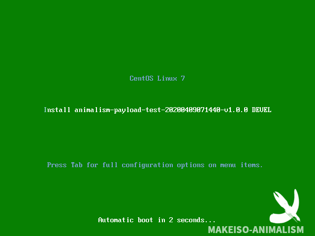
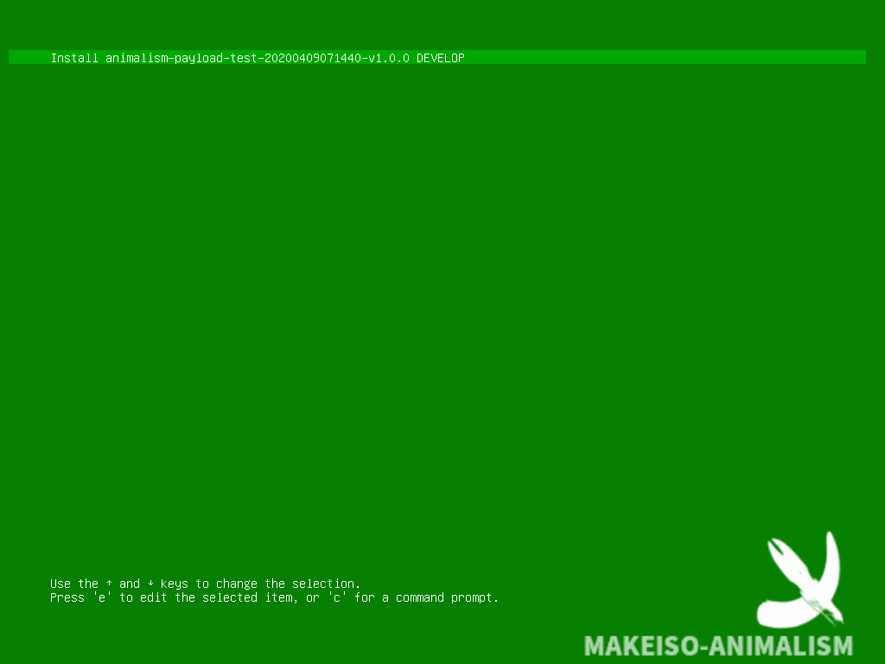

# Makeiso Animalism

[](https://996.icu)

This is a tool for making CentOS-7.4.1708 ISO of yourself.

This only works for CentOS-7.4.1708.

## Screenshot

### In BIOS mode



### In UEFI mode



(In this repository, all files, include readme, are derived from [makeiso-kuroko](https://github.com/catscarlet/makeiso-kuroko))

## Requirement

- An avaliable Linux platform. CentOS 7.5.1804 or newer is recommended because it includes rsync 3.1.1+
- A CentOS-7-x86_64-Everything-1708.iso image
- genisoimage (A RPM package is included in Everything 1708 iso image)
- createrepo (A RPM package is included in Everything 1708 iso image)
- rsync 3.1.1+ (not included in Everything 1708 iso image. A version 3.1.2 of rsync RPM package is included in this repository)

## Usage

Recommend order:

1. Modify the GLOBAL VARIABLE if needed.
2. Copy addtional files to `PAYLOAD_PATH` with a install.sh as the installation script, which you want to install after the system installed. Please notice **NO INTERACTIVE OPERATION IS ALLOWED**.
3. Run makeiso.sh to generate iso file. (Superuser is required because going to mount iso)

### GLOBAL VARIABLE

```
# INPUT
CENTOS7_EVERYTHING_ISO='/tmp/mountpoint/samba/share/CentOS-7-x86_64-Everything-1708.iso'
CENTOS7_EVERYTHING_ISO_MOUNTPOINT='/tmp/mountpoint/CentOS7-Everything-1708/'
PAYLOAD_PATH='./payload_sample/'
CONFIGDIR='boot.template/develop/'

# OUTPUT
NAMEPREFIX='PAYLOAD'
OUTPUTFILEDIR='./'
VERSION='v1.0.0'
TIMEZONE='UTC'

# Auto generated variables
VOLUMENAME=$NAMEPREFIX'-'`date +'%Y%m%d%H%M%S'`'-'$VERSION
VOLUMENAME_LABEL=`expr substr ${VOLUMENAME} 1 16`
FINALNAME=${VOLUMENAME}.iso
```

- **CENTOS7_EVERYTHING_ISO** Must be a accessiable CentOS-7-x86_64-Everything-1708.iso files.
- **PAYLOAD_PATH** is the addtional files you want to install after the system installation. After the system installation and auto reboot, `bash install.sh` will execute automatically once.
- **VOLUMENAME_LABEL** is for Volume ID and it only supports as long as 16 chars.

### Usage

```
Usage: # ./makeiso.sh -d [DEST_DIR=./] -v [RELEASE_VERSION=v1.0.0] -s [PAYLOAD_PATH=/root/payload_sample/] -7 [CENTOS7_EVERYTHING_ISO=/root/iso/CentOS-7-x86_64-Everything-1708.iso] -z [TIMEZONE=UTC]
```

Example 1:

`# ./makeiso.sh -7 /root/cifs/CentOS/CentOS-7-x86_64-Everything-1708.iso`

Example 2:

`# ./makeiso.sh -d /root/ -v test20200331 -s ./payload_sample/ -7 /root/cifs/CentOS/CentOS-7-x86_64-Everything-1708/CentOS-7-x86_64-Everything-1708.iso -z 'Asia/Shanghai'`

And you will get a ISO file. The default root password is 'makeiso-animalism'.

**To set the root password, please refer to [rootpw - Set Root Password](https://docs.fedoraproject.org/en-US/Fedora/html/Installation_Guide/sect-kickstart-commands-rootpw.html)**

**Notice that all the network interfaces DHCP are enabled in kickstart-post-script. Your network configuration in the Install Guide won't work.**

**There is no config about installation destination in kickstart-post. You still need to select the installation destination**

* * *

## Project Details

### Packager

```
.
├── 38b60f66d52704cffb8696750b2b6552438c1ace283bc2cf22408b0ba0e4cbfa-c7-x86_64-comps.xml
├── 83b61f9495b5f728989499479e928e09851199a8846ea37ce008a3eb79ad84a0-c7-minimal-x86_64-comps.xml
├── boot.template
│   └── develop
│       ├── EFI
│       │   └── BOOT
│       │       ├── grub.cfg
│       │       └── x86_64-efi
│       │           └── gfxterm_background.mod
│       └── isolinux
│           ├── isolinux.cfg
│           ├── payload-develop.cfg
│           └── splash.png
├── filelist
│   ├── centos_dvd_frame.list
│   └── minimal.list
├── generatefilelist.sh
├── makeiso.sh
├── payload_sample
│   └── install.sh
└── rsync-3.1.2-5.fc26.x86_64.rpm
```

- payload-develop.cfg, Kickstart files, including how to install automatically, the system language, network, root password, etc, A script which will executing after system installation and reboot is also included.
- centos_dvd_frame.list , CentOS-7-1708 DVD frameware files.
- minimal.list , RPM Package needed from Everything-DVD
- generatefilelist.sh , Diff 'installed RPM Package' between the current environment and Everything-DVD. This can be used to generate `your_rpm_payload.list`. **Notice that there is difference between MBR as EFI.** Not recommended if you don't know what this is for.

### ISO

```
.
├── CentOS_BuildTag
├── EFI
│   ├── BOOT
│   │   ├── BOOTX64.EFI
│   │   ├── fonts
│   │   │   ├── TRANS.TBL
│   │   │   └── unicode.pf2
│   │   ├── grub.cfg
│   │   ├── grubx64.efi
│   │   ├── MokManager.efi
│   │   └── TRANS.TBL
│   └── TRANS.TBL
├── EULA
├── GPL
├── images
│   ├── efiboot.img
│   ├── pxeboot
│   │   ├── initrd.img
│   │   ├── TRANS.TBL
│   │   └── vmlinuz
│   └── TRANS.TBL
├── isolinux
│   ├── boot.cat
│   ├── boot.msg
│   ├── grub.conf
│   ├── initrd.img
│   ├── isolinux.bin
│   ├── isolinux.cfg
│   ├── memtest
│   ├── payload-develop.cfg
│   ├── splash.png
│   ├── TRANS.TBL
│   ├── vesamenu.c32
│   └── vmlinuz
├── LiveOS
│   ├── squashfs.img
│   └── TRANS.TBL
├── Packages
│   ├── *.rpm
├── PAYLOAD
│   ├── install.sh
│   ├── *
├── repodata
│   ├── *
│   ├── repomd.xml
│   └── TRANS.TBL
├── RPM-GPG-KEY-CentOS-7
├── RPM-GPG-KEY-CentOS-Testing-7
└── TRANS.TBL
```

### Destination platform root
```
.
├── anaconda-ks.cfg
├── initial-setup-ks.cfg
├── initstart_flag.log
├── initstart.log
├── initstart.sh
├── kickstart-post.log
├── original-ks.cfg
├── PAYLOAD
│   ├── install.sh
│   └── *
├── payload_install.log
├── payload_log_sample.log
└── rpm_qa.list
```

- anaconda-ks.cfg, The kickstart file for this installation at this time.
- initial-setup-ks.cfg, The kickstart file for this installation at this time if you installed Desktop.
- kickstart-post.log The log of the script in POST of kickstart.
- initstart.sh, the script which will be executed after the system installation and reboot, including 'disable YUM source', 'install PAYLOAD', and remove itself from `/etc/rc.d/rc.local`
- initstart_flag.log, the result of executing `initstart.sh`
- initstart.log, the log of `initstart.sh`
- PAYLOAD, Your PAYLOAD
- payload_install.log, the log of PAYLOAD/install.sh
- payload_log_sample.log，the output of PAYLOAD/install.sh if you used the default payload_sample
- rpm_qa_develop.list, the result of 'rpm -qa' when the whole installation is finished.

## Build your own ISO

Anything doesn't relate to the CentOS-7-x86_64-Everything ISO is supposed to be put in PAYLOAD and be installed by install.sh

For something relates to the ISO, you can install a new CentOS7 by yourself, and run generatefilelist.sh to generate new rpm filelist, and upgrade kickstart.cfg and comps.xml by yourself. (Or just edit it in the Payload install.sh. It's fine)

This project is just for helping developers who don't familiar how to buid a CentOS ISO. You should write Kickstart-file (payload-develop.cfg) for your own project purpose.

## Other things

### Idea about naming this 'make linux iso project' Animalism

In day 1945.08.17, a novella was published. The name is _Animal Farm: A Fairy Story_ . That's it.

### Idea about naming the directory Payload

See it in my another reposity ["Idea about naming the directory Payload"](https://github.com/catscarlet/makeiso-kuroko/blob/master/README_zh-cmn-Hans.md#%E7%9B%AE%E5%BD%95%E5%90%8D-payload)

### Todo list

- Print logs not only in log file, but also in tty
- Replace rc.local using Systemd

## References

- [GRUB 2 Custom Splash Screen on RHEL 7 UEFI and Legacy ISO Image](http://www.tuxfixer.com/set-grub2-custom-splash-screen-on-rhel-7-centos-7-uefi-and-legacy-bios-iso-image/)
- [Grub2/Displays](https://help.ubuntu.com/community/Grub2/Displays#Troubleshooting_Splash_Images)
- [rootpw - Set Root Password](https://docs.fedoraproject.org/en-US/Fedora/html/Installation_Guide/sect-kickstart-commands-rootpw.html)

## Contribution

Any contributions are welcome. Pull request to branch **dev** please.

## License

Makeiso-Animalism is licensed under Anti-996-License, which is adapted from the MIT license.

The default splash image is from ["Flag of the Animal Farm"](https://commons.wikimedia.org/wiki/File:Flag_of_the_Animal_Farm.jpg#/media/File:Animalism_flag.svg) and it's licensed under a
["Creative Commons Attribution-Share Alike 3.0 Unported"](https://creativecommons.org/licenses/by-sa/3.0/deed.en)
